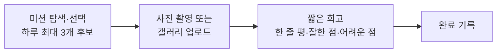
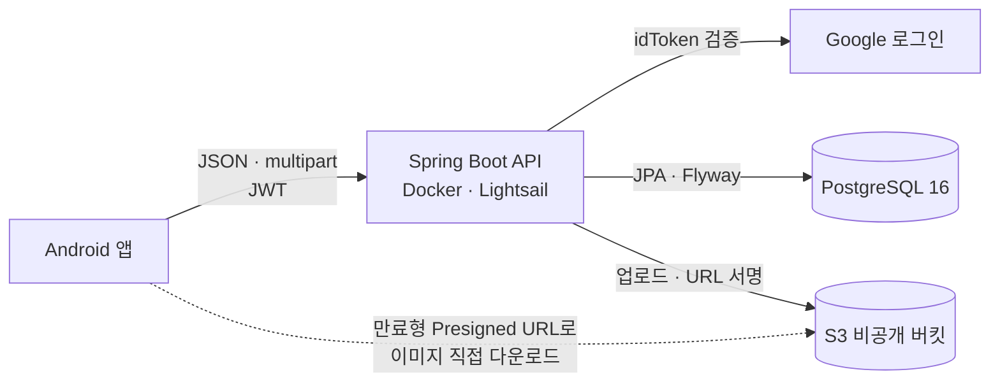

# FINDS — 사진 미션·회고 앱 백엔드 포트폴리오

**이동영 · 백엔드 개발 / 개발 리더** · SWYP 앱 6기 9팀 · 2026.08 ~ 진행 중

> 서버가 멈췄을 때는 데이터부터 지키고, 앱과 서버의 흐름이 어긋났을 때는 검증을 우회하지 않는 API로 풀고,
> 콘텐츠를 바꿀 때는 기존 기록의 연결을 보존했습니다.

📄 **[포트폴리오 PDF 보기](portfolio.pdf)** (10쪽) · 🔎 **[검증 근거와 한계](docs/evidence.md)**

이 저장소는 실제 서비스 코드 저장소가 아니라, FINDS 팀 프로젝트에서 **제가 맡은 일과 기술적 판단을 설명하는 포트폴리오**입니다.
서비스 코드와 이슈·PR은 팀 GitHub Organization의 비공개 저장소에 있으며 이 저장소에는 포함하지 않았습니다.

---

## FINDS 소개

**FINDS**는 사진 취미를 막 시작한 초보자와 가볍게 즐기는 사용자를 위한 **사진 미션·회고 앱**입니다.
평가나 경쟁보다 **개인의 촬영 경험과 기록**에 초점을 둡니다.

## 프로젝트와 내 역할

| 항목 | 내용 |
| --- | --- |
| 팀 | SWYP 앱 6기 9팀 — PM 2명, 디자이너 3명, 앱 개발자 1명, 백엔드 개발자 3명 |
| 기간 | 2026.08 ~ 진행 중 (2026.10.10 데모데이 예정) |
| 내 역할 | 백엔드 기능 구현, API 계약·앱 연동 조율, PR 리뷰, 운영 배포 및 장애 대응 |
| 내가 구현한 영역 | 이미지 업로드·검증과 Presigned URL, 미션 완료 기록 생성·조회, 게스트 후보 연결, 미션 콘텐츠 전환, 회고 길이 정책 |
| 팀원이 구현한 영역 | Google 로그인·토큰, 회원 가입·탈퇴, 미션 도메인과 후보 발급, 프로필 저장, 공통 404 |

### 기술 스택

| 구분 | 사용 기술 |
| --- | --- |
| 언어·프레임워크 | Java 17, Spring Boot 4.1.0, Gradle 9.5.1 |
| 데이터 | Spring Data JPA, PostgreSQL 16, Flyway |
| 인증 | Google idToken 검증, JWT |
| 이미지 | AWS S3 비공개 버킷, Presigned URL (AWS SDK v2) |
| 테스트 | JUnit 5, Testcontainers (PostgreSQL 16) |
| 운영 | AWS Lightsail, Docker / 로컬 개발 DB는 Docker Compose |

## 시스템 구조

백엔드 저장소의 코드를 기준으로 그린 구조입니다. 전체 구조는 백엔드 팀이 함께 만들었습니다.

---

## 핵심 기여

### 1. 운영 장애 진단과 서버 이전 → [상세](docs/server-incident.md)

| 구분 | 내용 |
| --- | --- |
| **문제** | 512MB 인스턴스에서 응답 지연·연결 끊김. 스왑 입출력과 I/O 대기가 높고 `docker stop`까지 시간 초과 |
| **판단** | 특정 API가 아니라 호스트 전체의 메모리 부족으로 판단. 종료 코드 137만으로 OOM을 확정하지 않음. 재시작보다 **데이터 보호를 먼저** |
| **조치** | `pg_dump` 백업과 목차 확인 → 스냅샷 기반 2GB 인스턴스 이전 → JVM 메모리 조정 → 고정 IP·방화벽 → 재기동 |
| **검증** | 관찰 시점 사용 가능 메모리 약 1.1GiB, swap in/out 0, ping 200 |
| **한계** | 부하 테스트·장기 안정성·실제 DB 복원 시험은 하지 않음 |

### 2. 게스트 선택 미션의 로그인 후 후보 연결 (#54) → [상세](docs/guest-mission-continuation.md)

| 구분 | 내용 |
| --- | --- |
| **문제** | 게스트 후보는 저장되지 않는데 완료 API는 인증 사용자의 오늘 후보를 요구해, 로그인 후 제출이 `MISSION_003`으로 거부 |
| **판단** | 완료 API의 인가 조건을 완화하지 않고, 로그인 직후 선택 미션을 **정당한 오늘 후보로 만드는 연결 API**를 추가 |
| **설계** | 후보 없음 → 연결 / 이미 포함 → 유지 / 미포함 → 기존 세트를 바꾸지 않고 거부. 홈 후보 발급과 같은 사용자 행 잠금으로 경쟁 방지 |
| **검증** | 실제 PostgreSQL 컨테이너 동시성 테스트, 연결 후 완료 성공 테스트. 개발 시점 전체 314건 통과 보고, 배포 확인 |
| **한계** | 게스트 노출 증명 없이 직접 선택을 허용하는 정책적 절충. **앱 연동 QA는 마지막 확인 기준 미확인** |

### 3. 기존 데이터를 보존한 미션 콘텐츠 전환 (#50) → [상세](docs/mission-data-migration.md)

| 구분 | 내용 |
| --- | --- |
| **문제** | 미션 24개를 최종 콘텐츠로 교체해야 하지만 후보·완료 기록이 미션 ID를 참조 |
| **판단** | 삭제·ID 재사용 없이 18개 갱신, 6개 비활성화, 6개 신규 추가 → 전체 30개(활성 24) |
| **설계** | 이미지 URL을 S3 object key로 옮기되 기존 URL 컬럼 보존. 응답 시 key가 있으면 Presigned URL 발급, 서명 실패는 감추지 않음 |
| **검증** | Flyway V13·V14 운영 적용과 30/24/6 확인. 배포 후 다운로드 403을 IAM 권한 부족으로 진단해 해당 접두사 읽기 권한만 추가, 1건 다운로드 확인 |
| **한계** | 과거 기록이 현재 미션 제목·태그를 표시. 코드만 단독 롤백 불가 |

---

## 추가 개선과 협업

| 항목 | 내 역할 | 상태 |
| --- | --- | --- |
| 이미지 3:4 비율 검증을 상대 오차 0.5% 이하 허용으로 변경 (#52) | 구현·배포 | 당시 전체 293건 통과 보고, 배포 완료. 실제 실패 사진 해결 여부 미확인 |
| 회고 세 항목 최대 길이 300자 통일 (#60) → [상세](docs/review-length-validation.md) | 구현·배포 | DTO·엔티티·DB(V15) 함께 변경, 운영 컬럼 길이 확인. 앱 300자 제출 QA 미확인 |
| Google 프로필 저장·갱신 (PR #57), 공통 404 응답 (PR #58) | **백엔드 팀원 구현** / 본인 리뷰·배포·동작 확인 | 배포 완료 |
| GA4 KPI·이벤트 정의 기술 검토 → [상세](docs/analytics-collaboration.md) | PM·앱 개발자와 설계 협의 | 기준 합의. 후속 이슈 #62 설계·정책 협의 중, 구현 완료 보고 없음 |
| 로컬 PostgreSQL 16 개발 환경과 실행 문서 (#49) | 구현 | 완료 |

---

## 자료 안내

| 자료 | 설명 |
| --- | --- |
| [portfolio.pdf](portfolio.pdf) | 채용 제출용 포트폴리오 (16:9, 10쪽) |
| [docs/](docs/) | 사례별 상세 문서 — 문제 → 근거 → 해결과 이유 → 검증 → 한계 |
| [docs/evidence.md](docs/evidence.md) | 주장별 근거 유형(코드 확인 / 운영·실행 보고 / 미확인)과 기여 구분 |
| [index.html](index.html), [styles.css](styles.css) | PDF의 HTML/CSS 원본. 저장소를 내려받아 브라우저로 열면 볼 수 있음 |

- 문서에 나오는 이슈·PR 번호, 파일명, 커밋은 **팀 비공개 저장소 기준**이라 외부에서 열람할 수 없습니다.
- 코드 설명은 직접 작성한 의사코드와 구조도로 대신했습니다. 서비스 소스 코드는 포함하지 않았습니다.
- 실제 서비스 화면은 공개 동의를 받지 않아 싣지 않았습니다.

### PDF 다시 만들기

`index.html`을 Chrome 또는 Edge로 열고 인쇄(`Ctrl+P`) → **PDF로 저장**, 여백 **없음**, **배경 그래픽 켬**으로 저장합니다.
용지 크기(1280×720px)는 CSS의 `@page`가 지정하며, 화면 상단 안내 문구는 인쇄 시 숨겨집니다. 원격 리소스 없이 로컬 글꼴만 사용합니다.

### 글꼴

`assets/fonts`의 글꼴은 Noto Sans CJK KR을 줄인 수정본이며 [SIL Open Font License 1.1](assets/fonts/OFL.txt)을 따릅니다.
이 라이선스는 글꼴 파일에만 적용됩니다.
