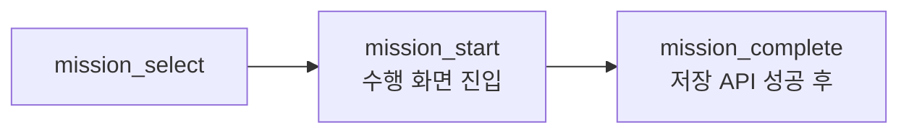

# KPI 정의를 실제 계측·API 요구사항으로 구체화

> PM이 작성한 KPI와 GA4 이벤트 정의를 실제 앱 화면 흐름과 서버 API 처리 단위에 맞춰 검토한 협업 사례입니다.
> **설계 검토와 협의 결과이며, 데이터 수집·분석은 아직 시작 전입니다.**

[← README로 돌아가기](../README.md) · [근거와 한계 전체 보기](evidence.md)

| 항목 | 내용 |
| --- | --- |
| 역할 구분 | KPI·정책 문서 작성과 최종 기획 결정은 PM과의 공동 작업, 앱 이벤트 구현은 앱 개발자 담당 |
| 내 기여 | 기술적 모순·누락 검토, 서버 계약과 앱·서버 연동 범위 조율 |
| 상태 | 기준 합의. 후속 이슈 #62는 기존 코드 조사·설계 보완·PM 정책 협의까지 진행(2026.10.02 기준), 구현·테스트·배포 완료 보고 없음 |
| 근거 | 팀 문서와 대화(비공개). 공개 허락이 확인되지 않아 원문·캡처 대신 익명화한 요약만 사용 |

---

## 1. 발견한 문제

| 문제 | 그대로 두면 생기는 일 |
| --- | --- |
| 사진 업로드 실패가 완료 실패 이벤트에서 빠져 있음 | 업로드 단계의 실패가 지표에서 보이지 않음 |
| 오류 유형이 앱이 실제로 구분할 수 없는 기준으로 정의됨 | 이벤트 값이 일관되게 채워지지 않음 |
| 노출과 선택의 집계 단위가 다름 | 같은 사람이 홈을 여러 번 열수록 선택률이 실제보다 낮게 계산됨 |
| 미션 시작이 버튼 클릭 기준 | 클릭 후 수행 화면에 들어가지 못한 경우도 시작으로 셈 |
| 게스트 이어하기는 선택 이벤트 없이 시작부터 기록될 수 있음 | 퍼널에서 select 없는 start가 생겨 전환율 계산이 어긋남 |
| 회고 작성량 구간이 이전 길이 정책 기준 | 300자 정책으로 바뀐 뒤 구간이 맞지 않음 |

## 2. 제안한 기준

- 사진 업로드 실패도 **완료 실패**에 포함합니다.
- 오류 유형은 앱이 실제로 구분할 수 있는 **업로드 · 최종 제출 · 네트워크**로 나눕니다.
- 재시도는 **각각 별도 시도**로 집계합니다.
- 노출과 선택은 모두 **앱 인스턴스 · 미션 · KST 날짜** 조합으로 각각 중복 제거합니다.
  날짜 경계는 서버가 오늘 후보를 정하는 기준(KST)과 맞췄습니다.
- `mission_start`는 버튼 클릭이 아니라 **실제 수행 화면 진입** 시점에 기록합니다.
- `mission_complete`는 **최종 저장 API의 성공 응답 이후**에 기록합니다. 서버가 거부한 제출은 완료가 아닙니다.
- 게스트 이어하기에서 `mission_select` 없이 `mission_start`가 기록될 수 있다는 점을 **분석 예외**로 문서에 명시합니다.
  ([게스트 이어하기 사례](guest-mission-continuation.md)의 흐름과 연결됩니다.)
- 회고 작성량 구간을 [300자 정책](review-length-validation.md)에 맞춰 갱신하고, **회고 원문은 전송하지 않습니다.**

## 3. PM과 정리된 분석 방향

- 핵심 퍼널: `mission_select` → `mission_start` → `mission_complete`
- 재방문 지표: 첫 완료일(D0)을 제외하고 KST 기준 D1~D7의 추가 완료를 집계
- 분모: D7까지 관찰이 끝난 앱 인스턴스만 포함하고, QA 대상은 제외
- MVP 분석 단위는 회원 계정이 아니라 **앱 인스턴스**
- D1~D7 집계와 태그 매핑은 BigQuery 기준으로 진행할 계획
- 미션 필터 적용 이벤트는 MVP에서 제외

## 4. 앱·서버 연동 범위 조율

- 기존 앱 이벤트 구현 현황을 확인했습니다.
- 분석 선택 동의는 **저장만이 아니라 조회·변경·철회**, 그리고 **로그인 상태 변화에 따른 수집 제어**까지 앱과 서버가 함께 다뤄야 한다고 범위를 정리했습니다.

## 5. 아직 하지 않은 것

| 항목 | 상태 |
| --- | --- |
| 분석 선택 동의 API | 서버 저장소(마지막 조사 기준 `918b5c2`)에 없음. 후속 이슈 #62에서 설계·정책 협의 진행 중, 구현 완료 보고 없음 |
| 앱 이벤트 구현 | 앱 개발자 담당, 완료 여부 미확인 |
| BigQuery Daily Export 연결과 실제 적재 확인 | 후속 작업 |
| 지표 개선 수치, 분석 성과 | 수집 전이므로 없음 |
