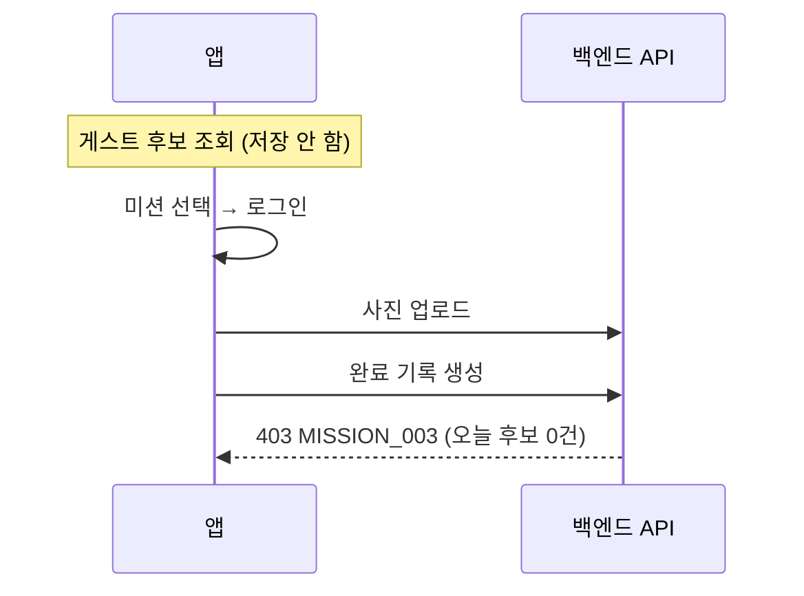
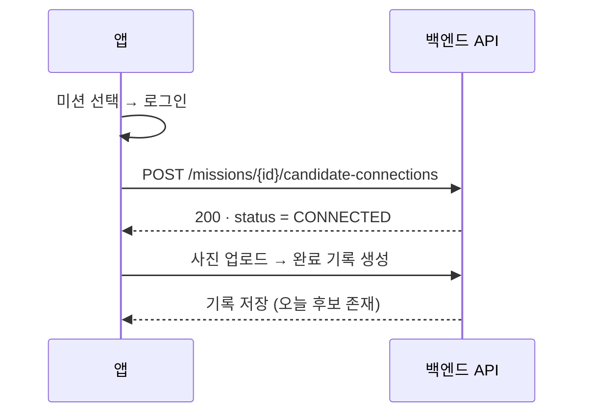

# 게스트 선택 미션의 로그인 후 후보 연결

> 게스트로 고른 미션을 로그인 후 제출하면 거부되던 문제입니다.
> 완료 API의 인가 조건을 완화하지 않고, 로그인 직후 선택 미션을 오늘 후보로 연결하는 API를 추가했습니다.

[← README로 돌아가기](../README.md) · [근거와 한계 전체 보기](evidence.md)

| 항목 | 내용 |
| --- | --- |
| 이슈 / PR | #54 / PR #59 (팀 비공개 저장소) |
| 담당 | 이동영 — 원인 조사, API 설계·구현, 테스트, API 문서, 배포 |
| 함께한 일 | 기존 후보 발급 로직(#25)과 PR 병합은 백엔드 팀원, 앱의 연결 API 적용은 앱 개발자 담당 |
| 상태 | 백엔드 구현·배포 완료. **마지막 확인 기준 앱 연동 QA 미확인** |

---

## 1. 문제

FINDS는 하루 최대 3개의 미션 후보를 보여주고, 사용자는 그중 하나를 수행합니다.

- 게스트 후보는 매번 새로 뽑으며 **DB에 저장하지 않습니다.**
- 게스트가 미션을 고른 뒤 로그인하면, 앱은 홈 후보 발급을 거치지 않고 바로 수행 화면으로 이동했습니다.
- 완료 기록 API는 **인증 사용자의 오늘(KST) 후보에 있는 미션만** 완료를 허용합니다.
- 그 결과 제출이 `403 MISSION_003`(오늘 발급된 후보가 아닌 미션)으로 거부됐습니다.

## 2. 근거

- 실제 실패 요청에서 업로드 이미지의 소유자를 확인했습니다.
- 그 사용자의 당일 `mission_candidates`를 조회하니 0건이었습니다. (사용자 ID·이미지 식별값은 공개 자료에서 제외)
- 따라서 데이터 손상이 아니라 **앱의 화면 흐름과 서버 인가 조건이 어긋난 것**으로 판단했습니다.



## 3. 선택한 해결책과 이유

### 완료 API를 완화하지 않은 이유

완료 기록 API는 **당일 후보 여부, 같은 미션 당일 중복 완료, 이미지 소유권**을 검사하는 인가 지점입니다.
후보 검사를 빼면 어떤 미션이든 완료할 수 있게 됩니다. 그래서 이 검증은 그대로 두고,
로그인 직후 **선택한 미션을 정당한 오늘 후보로 만드는 단계**를 앞에 추가했습니다.

### 연결 API

`POST /api/v1/missions/{missionId}/candidate-connections` (인증 필수)

| 오늘 후보 상태 | 응답 `status` | 처리 |
| --- | --- | --- |
| 없음 | `CONNECTED` | 선택 미션을 1번으로 두고, 나머지는 기존 발급 규칙(최근 48시간 노출 제외·가중치 선정·부족분 보충)으로 최대 3개 발급 |
| 선택 미션 포함 | `ALREADY_CANDIDATE` | 기존 세트를 그대로 반환. 발급 후 비활성화된 미션도 이어서 수행 가능 |
| 선택 미션 미포함 | `REJECTED_CANDIDATES_ALREADY_FIXED` | 기존 세트를 교체·추가·재정렬하지 않고 거부. 기존 후보는 응답에 함께 반환 |

- 세 결과는 모두 HTTP 200입니다. `success: true`는 연결 성공을 뜻하지 않으므로 앱은 **반드시 `data.status`로 분기**해야 한다고 API 문서에 적었습니다.
- 인증 실패, ID 형식 오류, 존재하지 않거나 비활성인 미션은 별도 4xx로 응답합니다.



### 앱과 맞춘 호출 계약

- 로그인 직후 **홈 후보 발급보다 연결 API를 먼저** 호출합니다. 홈 발급이 먼저 끝나면 다른 3개가 확정되어 연결이 거부될 수 있기 때문입니다.
- 거부 상태에서는 함께 내려준 오늘 후보로 홈 화면을 안내할 수 있습니다.

### 동시성: 기존 발급과 같은 잠금

아래는 **설명용 의사코드**입니다. 직접 작성했으며 실제 서비스 코드 발췌가 아닙니다.

```text
연결요청(인증 사용자, 선택 미션):
  사용자 행 잠금                 // SELECT … FOR UPDATE — 홈 후보 발급과 같은 잠금
  기준시각 = 시계.지금()          // 잠금을 얻은 뒤 한 번만 읽음
  오늘 = KST 날짜(기준시각)
  오늘후보 = 후보 조회(사용자, 오늘)
  만약 오늘후보가 있으면:
    선택 미션이 포함   → ALREADY_CANDIDATE            // 세트 유지
    포함되지 않음      → REJECTED_CANDIDATES_ALREADY_FIXED
  선택 미션 존재·활성 확인        // 실패 시 MISSION_001
  후보 = [선택 미션] + 기존 발급 규칙으로 고른 나머지
  저장 후 → CONNECTED
```

- 홈 후보 발급도 같은 사용자 행을 먼저 잠급니다. 두 요청이 동시에 와도 **먼저 잠근 쪽만 오늘 후보 세트를 확정**하고, 뒤의 요청은 확정된 세트를 보고 판정합니다.
- 잠금을 얻은 뒤 시각을 한 번만 읽어, 한 요청 안에서 "오늘"이 바뀌지 않게 했습니다.
- 나머지 슬롯은 기존 발급 로직을 그대로 재사용해 규칙이 두 갈래로 나뉘지 않게 했습니다.

## 4. 검증

| 항목 | 내용 | 근거 |
| --- | --- | --- |
| 동시성 | 발급·연결 동시 요청 시 후보가 정확히 3개로 유지, 서로 다른 미션 동시 연결 시 한 요청만 성공. 실제 PostgreSQL 16 컨테이너(Testcontainers) | 테스트 코드 확인 |
| 종단 흐름 | 연결 후 완료 기록 생성 성공, 연결→발급 순서에서 같은 세트, 발급→세트 밖 연결 거부, 사용자 간 격리, 전날 후보 무시 | 테스트 코드 확인 |
| 실행 결과 | 개발 시점 전체 테스트 314건, 실패·오류·스킵 0 | 당시 실행 보고 |
| 배포 | `e6cdb17` 기반 배포, 기본 기동 확인 | 운영 보고 |

## 5. 한계

- **정책적 절충:** 게스트 화면에서 실제로 그 미션을 봤다는 증명 토큰이 없습니다. 그래서 오늘 후보가 없는 인증 사용자는 활성 미션 1개를 직접 고를 수 있습니다. 이 점을 API 문서에 "이 API가 증명하지 않는 것"으로 명시했습니다.
- 미션 활성 확인과 저장 사이에 다른 트랜잭션이 미션을 비활성화하는 경쟁은, 미션 행 잠금이 없어 원자적으로 막지 않습니다.
- 자정 전후나 잠금 대기 중 날짜가 바뀌는 상황은 직접 테스트하지 않았습니다. 고정 시각을 주입한 시계로 "전날 후보" 케이스만 검증했습니다.
- 배포 후 기존 앱으로 제출했을 때 MISSION_003이 다시 발생했습니다. 그 앱은 아직 연결 API를 호출하지 않는 버전이었습니다.
- **연결 API를 적용한 앱 버전의 종단 간 QA 완료는 마지막 확인 기준 보고받지 못했습니다.** 따라서 "사용자 오류 완전 해결"로 표현하지 않습니다.
