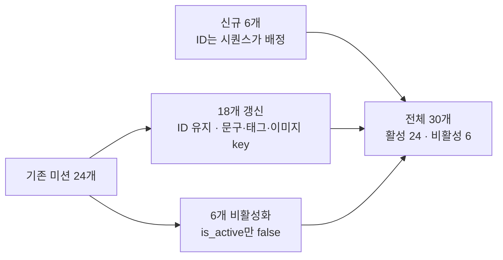

# 기존 데이터를 보존한 미션 콘텐츠 전환

> 최종 기획 콘텐츠로 미션을 교체하면서, 이미 쌓인 후보·완료 기록이 가리키는 미션 ID를 하나도 지우거나 재사용하지 않았습니다.
> 배포 후에는 서명 URL 생성 성공과 실제 다운로드 권한을 구분해 S3 403을 해결했습니다.

[← README로 돌아가기](../README.md) · [근거와 한계 전체 보기](evidence.md)

| 항목 | 내용 |
| --- | --- |
| 이슈 / PR | #50 / PR #51 (팀 비공개 저장소) |
| 담당 | 이동영 — 마이그레이션 설계·작성, 이미지 해석 로직, 비활성 정책 테스트, 배포, S3 403 조사 |
| 함께한 일 | PR 병합은 백엔드 팀원 |
| 상태 | 운영 적용 확인. 가이드 이미지 다운로드는 1건만 확인 |

---

## 1. 문제

- 기존 미션 24개를 최종 콘텐츠로 바꿔야 했습니다.
- `mission_candidates`(오늘 후보)와 `mission_records`(완료 기록)가 미션 ID를 참조합니다.
- 미션을 삭제하면 FK에 막히거나 기록이 끊기고, ID를 다른 미션에 재사용하면 **과거 기록이 전혀 다른 미션을 가리키게** 됩니다.
- 가이드 이미지도 외부 URL 방식에서 비공개 S3 object key 방식으로 옮겨야 했습니다.

## 2. 선택한 해결책과 이유

### 삭제 없이 갱신·비활성화·신규 추가만 사용

### 마이그레이션을 두 단계로 분리

| 버전 | 내용 | 이유 |
| --- | --- | --- |
| V13 | `reference_image_key` 컬럼을 nullable로 추가. 기존 `reference_image_url`은 값까지 그대로 유지 | 배포 중인 구버전 앱은 새 컬럼을 매핑하지 않아 영향이 없음 |
| V14 | 활성 미션 CHECK 제약을 "URL **또는** key가 있어야 함"으로 바꾼 뒤 콘텐츠 반영 | 신규 6개는 key만 가지므로 제약을 먼저 조정 |

- V14는 테스트용 H2에서도 같은 스크립트가 돌도록 `ON CONFLICT` 대신 `NOT EXISTS`를 사용했습니다.
- 신규 미션 ID를 파일에 하드코딩하지 않고, 삽입 후 제목으로 태그를 연결했습니다.

### 응답 시 이미지 해석 규칙

- 한 곳(`MissionReferenceImageResolver`)에서 처리합니다. key가 있으면 만료형 Presigned GET URL을 발급하고, 없을 때만 기존 URL을 반환합니다. 두 값을 섞지 않습니다.
- 서명에 실패하면 예외를 그대로 전파합니다. **더미 URL로 감추지 않습니다.**

### 비활성 미션 정책

- 이미 발급된 **본인의 당일 후보**는 비활성화 이후에도 재조회·상세·완료를 허용합니다. 비활성화 전에 이미 받은 오늘 후보는 계속 완료할 수 있어야 하기 때문입니다.
- 신규 후보 선정과 게스트 후보에서는 비활성 미션을 제외하고, 다른 사용자의 상세·완료는 거부합니다.

## 3. 검증

| 항목 | 내용 | 근거 |
| --- | --- | --- |
| 비활성 전환 | 당일 후보 재조회·상세·완료 허용, 신규·게스트 발급 제외, 타인·과거 후보 접근 거부, key 유무에 따른 이미지 해석 | 테스트 코드 확인 (PostgreSQL 16 컨테이너) |
| 운영 적용 | Flyway V13·V14 성공, 전체 30 / 활성 24 / 비활성 6, 이미지 key가 있는 활성 미션 24개 | 운영 보고 |

### 배포 후 가이드 이미지 403

Presigned URL은 정상 발급되는데 다운로드는 403이었습니다.

- **판단:** Presigned URL은 SDK가 서명을 로컬에서 계산할 뿐이라, 생성이 성공해도 권한이 있다는 뜻은 아닙니다. 권한은 다운로드 시점에 서명 주체 기준으로 평가됩니다.
- **원인:** 실제 응답을 조사한 결과, 앱이 쓰는 IAM 주체에 가이드 이미지 접두사의 `s3:GetObject` 허용이 없었습니다.
- **조치:** 해당 접두사에 한정한 읽기 권한만 추가했습니다. 버킷을 공개하지 않았습니다.
- **확인:** 이미지 1건에서 HTTP 200, `image/jpeg` 다운로드를 확인했습니다.

(계정 ID, IAM 주체 이름, 버킷 이름, 실제 접두사, URL은 공개 자료에서 제외했습니다.)

## 4. 한계

- 기록 상세는 완료 당시 스냅샷이 아니라 **현재 미션 제목·태그**를 읽습니다. 그래서 갱신된 18개 미션의 과거 기록 표시도 함께 바뀝니다.
- **코드만 이전 버전으로 되돌릴 수 없습니다.** 구버전은 URL 필드만 읽으므로 key만 가진 신규 6개 미션의 이미지 URL이 null이 됩니다. 롤백에는 데이터 대응이 함께 필요합니다.
- 활성 미션 24개 전체 이미지의 다운로드는 검증하지 않았습니다. 확인한 것은 1건입니다.
